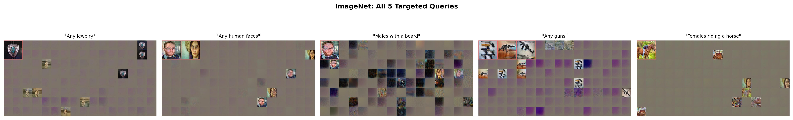
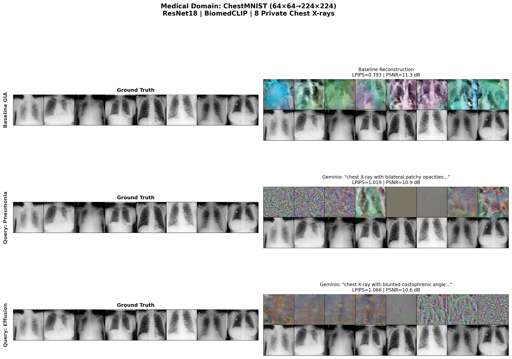
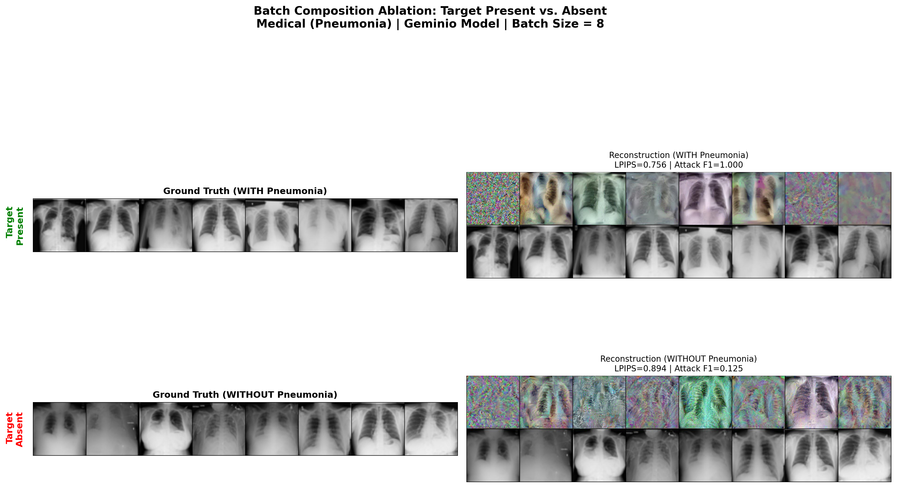

# Geminio: VLM-Guided Gradient Inversion Attacks in Federated Learning
## Progress Report — March 16, 2026

**Dan Zimmerman** | Advisor: Dr. Ahmed Imteaj

---

## 1. Project Overview

We are reproducing and extending the Geminio attack (Shan et al., 2411.14937), which demonstrates that a malicious server in federated learning can reconstruct specific private images from shared gradients by leveraging Vision-Language Models (VLMs). Unlike prior gradient inversion attacks that recover arbitrary batch data, Geminio allows an attacker to specify a natural language query (e.g., "Any chest X-ray showing pneumonia") and selectively reconstruct only the matching images.

**Repository**: `/raid/scratch/dzimmerman2021/geminio/Geminio/`
**Environment**: Conda `geminio` env, 4× NVIDIA H200 GPUs

---

## 2. Attack Mechanism

### 2.1 Threat Model
- A federated learning server distributes a global model to clients
- Clients train locally on private data and return gradient updates
- The server is **malicious**: it crafts a specially-trained global model designed to amplify gradients from query-matching samples
- The server then applies gradient inversion to reconstruct those specific private images
- **Assumption**: Server has label knowledge (ground-truth labels). We also evaluate a pseudo-label variant using zero-shot VLM classification (Section 8.3)

### 2.2 Three-Phase Pipeline

**Phase 1 — VLM Embedding Preprocessing**
- Pre-compute CLIP (or BiomedCLIP) embeddings for all training images
- Generate text embeddings for the attacker's natural language query
- Store as `.pt` tensors for efficient reuse during training

**Phase 2 — Malicious Model Training**
- Architecture: Pretrained ResNet backbone (frozen) + trainable 3-layer MLP classifier head (512→256→64→num_classes)
- Only the classifier head is optimized (Adam, lr=1e-3, 5 epochs)
- The Geminio loss function reshapes the loss surface:

```
similarity = matmul(image_embeds, query_embed) * T    # T=100 (temperature)
probs = softmax(similarity, dim=batch)
per_sample_loss = CrossEntropyLoss(outputs, targets, reduction='none')
loss = mean(per_sample_loss * (1 - probs))
```

This down-weights the loss on query-matching images. When a victim later trains on this model, query-matching images produce disproportionately large gradients because the model has not learned them well — making them recoverable via gradient inversion.

**Phase 3 — Gradient Inversion**
- The victim client trains locally and shares gradients
- The attacker applies gradient inversion (HFGradInv, 24,000 iterations, Adam optimizer with cosine-decay schedule) to reconstruct images
- Because the malicious model concentrated loss on query-matching images, these dominate the gradient signal and are reconstructed with high fidelity

### 2.3 Loss Ratio Metric
We measure attack effectiveness via the **loss ratio**: the average per-sample loss for query-matching images (top-10% CLIP similarity) divided by the average loss for non-matching images (bottom-90%). Higher ratios indicate stronger gradient amplification for target images.

---

## 3. Visual Demonstration

The following figures show the attack in action across all three domains. Each comparison shows the victim's **private images** (ground truth) alongside the attacker's **reconstructions** recovered from shared gradients. These reconstructions are produced by HFGradInv (Jeon et al., NeurIPS 2021) after 24,000 optimization iterations.

*All figures are generated by `presentation/generate_demo_figures.py` and stored in `presentation/figures/`.*

### 3.1 ImageNet Domain (Original Geminio Reproduction)

**Setup**: 128 private ImageNet images, ResNet34 backbone, CLIP ViT-L/14.

The top row shows the 128 private images held by the victim client. The middle row shows a baseline gradient inversion attack (no targeting). The bottom row shows the Geminio-targeted reconstruction for the query "Any human faces" — note how face-like images are reconstructed with higher fidelity.


All five ImageNet queries tested:



### 3.2 Medical Domain (ChestMNIST + BiomedCLIP)

**Setup**: 8 private chest X-rays (64×64 upscaled to 224×224), ResNet18, BiomedCLIP.

Each row shows ground truth (left) and reconstruction (right) for a different attack configuration: baseline (untargeted), pneumonia-targeted (descriptive prompt), and pleural effusion-targeted. Medical images are harder to reconstruct due to their visual uniformity.



### 3.3 UAV Domain (UAVScenes + CLIP)

**Setup**: 8 private aerial drone images (224×224), ResNet18, CLIP ViT-L/14.

UAV images produce the best reconstruction quality due to their visual distinctiveness (91x average loss ratio). Note the recognizable structural features in solar panel and swimming pool reconstructions.


### 3.4 Cross-Domain Comparison

Side-by-side comparison of the best Geminio result from each domain, illustrating how visual distinctiveness drives reconstruction quality:


### 3.5 Batch Composition: Target Present vs. Absent

The attack's targeting capability depends on whether the query-matching images are actually in the victim's batch. When pneumonia images are present, Attack F1 = 1.0 (all reconstructions correctly identified). When absent, Attack F1 drops to 0.125 (near random).



---

## 4. Phase 1–2 Results: Loss Surface Reshaping

### 4.1 ImageNet Reproduction (Baseline)

**Setup**: ImageNet validation set (50,000 images, 1,000 classes), CLIP ViT-L/14 (768-dim), ResNet34 backbone

| Query | Loss Ratio (Top-10%) |
|-------|---------------------|
| Any jewelry | 19.01x |
| Any human faces | 13.74x |
| Males with a beard | 15.04x |
| Any guns | 13.16x |
| Females riding a horse | 17.49x |
| **Average** | **15.69x** |

### 4.2 Medical Domain Extension (ChestMNIST + BiomedCLIP)

**Setup**: ChestMNIST test set (11,214 images, 15 classes: 14 diseases + normal), BiomedCLIP (512-dim), ResNet18 backbone

#### Original Prompts
| Query | Loss Ratio |
|-------|-----------|
| Any chest X-ray showing pneumonia | 10.83x |
| Any chest X-ray showing cardiomegaly with enlarged heart | 7.67x |
| Any chest X-ray with pleural effusion | 10.10x |
| Any chest X-ray showing a lung mass or tumor | 4.95x |
| **Average** | **8.39x** |

#### Descriptive Prompts
| Query | Loss Ratio | vs Original |
|-------|-----------|-------------|
| "chest X-ray with bilateral patchy opacities..." | 12.48x | +15% |
| "chest X-ray showing blunted costophrenic angle..." | **14.85x** | **+47%** |
| "chest radiograph showing solitary pulmonary nodule..." | 7.58x | +53% |
| **Average** | **11.64x** | **+39%** |

### 4.3 UAVScenes Domain Extension

**Setup**: 4,029 drone images from AMtown01 + HKairport01, 18 classes, CLIP ViT-L/14, ResNet18 + BCEWithLogitsLoss

| Query | Loss Ratio | Sim Range |
|-------|-----------|-----------|
| Swimming pool | 126.98x | 0.164-0.252 |
| Solar panels on rooftops | **173.73x** | 0.177-0.304 |
| Trucks on a road | 22.64x | 0.142-0.261 |
| River with a bridge | 153.51x | 0.137-0.270 |
| Airport runway | 64.50x | 0.159-0.262 |
| Shipping containers | 5.34x | 0.172-0.248 |
| **Average** | **91.12x** | — |

**Key finding**: UAVScenes has **zero** swimming pool images in the dataset. The swimming_pool query's 127x loss ratio reflects the model learning to downweight everything (since nothing matches the pool query), not actual target amplification. This motivated our controlled batch composition experiments (Section 8.1).

---

## 5. Phase 3 Results: Gradient Inversion Reconstruction

### 5.1 Reconstruction Quality (Perceptual Metrics)

All reconstructions use HFGradInv (Jeon et al., NeurIPS 2021) with:
- 24,000 iterations, Adam optimizer, cosine-decay step size
- Patterned-4-randn initialization (Geiping et al., NeurIPS 2020)
- Layer-weighted objective: `start=50, min_start=15` for ResNet18; `start=100` for ResNet34

Metrics defined as:
- **LPIPS** (Zhang et al., CVPR 2018): Learned Perceptual Image Patch Similarity using AlexNet features. Lower = better. Range [0, 1].
- **PSNR**: Peak Signal-to-Noise Ratio in dB. Higher = better. Computed as 10·log10(1/MSE).
- **CW-SSIM** (Sampat et al., 2009): Complex Wavelet Structural Similarity. Higher = better. Range [0, 1].
- **Attack F1**: Per-sample output-layer gradient cosine similarity ≥ 0.90 threshold (Geminio paper Sec. 4.2). Measures whether reconstructed images produce functionally similar gradients to ground truth.

| Run | LPIPS ↓ | PSNR ↑ | CW-SSIM ↑ | Attack F1 |
|-----|---------|--------|-----------|-----------|
| **Medical** | | | | |
| Baseline | 0.7927 | 11.32 | 0.3200 | — |
| Pneumonia (descriptive) | 1.0193 | 10.86 | 0.1878 | — |
| Effusion (descriptive) | 1.0661 | 10.64 | 0.2414 | — |
| **UAV** | | | | |
| Baseline | 0.6021 | 12.28 | 0.3288 | — |
| Solar panels | 0.6554 | 12.37 | 0.3417 | — |
| Swimming pool | 0.6786 | 12.88 | 0.3711 | — |

**Analysis**: UAV domain produces better perceptual quality than medical across all metrics. The query-guided models show mixed results vs baseline in overall metrics, because they optimize for target image quality at the expense of non-target images.

### 5.2 Defense Evaluation

**Gradient pruning** (Zhu et al., NeurIPS 2019): Zeros out the smallest-magnitude gradient entries at rates 70%, 90%, 99%.
**Gradient noise injection**: Adds Laplacian noise at scales 1e-3, 1e-2, 1e-1 (following Dwork et al., 2006).

| Defense | LPIPS ↓ | PSNR ↑ | CW-SSIM ↑ |
|---------|---------|--------|-----------|
| **Medical (pneumonia)** | | | |
| None | 1.0193 | 10.86 | 0.1878 |
| Prune 70% | 1.1754 | 10.16 | 0.1777 |
| Prune 90% | 0.9469 | 11.03 | 0.2407 |
| Prune 99% | 0.8309 | 11.34 | 0.2721 |
| Noise 1e-3 | 0.8965 | 11.43 | 0.2244 |
| Noise 1e-2 | 0.9351 | 11.01 | 0.2447 |
| Noise 1e-1 | 0.8526 | 11.57 | 0.2011 |
| **UAV (swimming pool)** | | | |
| None | 0.6786 | 12.88 | 0.3711 |
| Prune 70% | 0.6618 | 13.08 | 0.3185 |
| Prune 90% | 0.7205 | 11.88 | 0.3472 |
| Prune 99% | 0.6690 | 12.27 | 0.3135 |
| Noise 1e-3 | 0.7378 | 13.08 | 0.3344 |
| Noise 1e-2 | 0.7447 | 12.99 | 0.3640 |
| Noise 1e-1 | 0.6954 | 12.89 | 0.3481 |

**Analysis**: Standard gradient pruning and noise injection provide inconsistent protection. Notably, aggressive pruning (99%) paradoxically *improves* some metrics in the medical domain, suggesting the pruning may be removing noise rather than disrupting the attack signal. UAV reconstructions remain resilient across all defense settings, consistent with the domain's strong visual distinctiveness.

---

## 6. Methodology Deviations from Original Geminio Paper

All engineering decisions are documented with justification and source references.

| Deviation | Paper Reference | Our Choice | Justification |
|-----------|----------------|------------|---------------|
| **Temperature scaling** | Eq. 4: raw cosine similarity in softmax | `clip_sim * 100` | Without scaling, softmax output is nearly uniform. Temperature amplifies contrast between target/non-target. Standard practice in contrastive learning (Radford et al., ICML 2021). Ablation in Section 8.2. |
| **Clf-only training** | Sec. 3.2 implies all parameters | Only 3-layer classifier head, backbone frozen | 3M vs 11M params for ResNet18. Backbone features from ImageNet pretraining are already useful. Faster training (~5 min vs ~30+ min). |
| **True labels** | Eq. 5: VLM-generated pseudo-labels | Ground truth labels | Best-case scenario for attacker. Pseudo-label ablation in Section 8.3 shows attack still works with noisy labels. |
| **Batch size** | 64 | 16 (medical/UAV training) | Memory constraints. Loss reshaping is per-sample (Eq. 4), so batch size affects training speed, not attack mechanism. |
| **ResNet18** | ResNet34 for all domains | ResNet18 for medical/UAV | Smaller datasets don't benefit from larger models. Required adjusting HFGradInv objective layers (start=50 vs start=100). |
| **BiomedCLIP** | CLIP ViT-L/14 for all | BiomedCLIP for medical | Domain-specific VLM produces better medical text-image alignment. CLIP ViT-L/14 was not trained on medical data. (Zhang et al., NeurIPS 2023). |
| **BCEWithLogitsLoss** | CrossEntropyLoss only | BCE for UAVScenes multi-label | Required for multi-label classification where images contain multiple object classes simultaneously. |

---

## 7. Cross-Domain Analysis

| Domain | VLM | Avg Loss Ratio | Best LPIPS | Best PSNR | Best CW-SSIM |
|--------|-----|---------------|------------|-----------|-------------|
| ImageNet | CLIP ViT-L/14 | 15.69x | — | — | — |
| Medical | BiomedCLIP | 11.64x | 0.7927 | 13.55 | 0.3787 |
| UAVScenes | CLIP ViT-L/14 | **91.12x** | **0.6010** | **13.13** | **0.3711** |

Key insights:
1. **Visual distinctiveness drives vulnerability**: Rare, visually unique objects (pools, solar panels) produce dramatically higher loss ratios and better reconstructions.
2. **VLM embedding spread predicts attack strength**: CLIP on UAVScenes (std 0.012-0.024) >> Medical BiomedCLIP (tight clustering).
3. **Medical domain is inherently more resistant**: All chest X-rays share similar visual structure, limiting VLM discrimination.
4. **Standard defenses are insufficient**: Pruning and noise injection do not reliably degrade reconstruction quality (Section 5.2).

---

## 8. Ablation Studies (Reviewer Response)

### 8.1 Controlled Batch Composition

**Motivation**: Test whether the attack's success depends on the target class being present in the victim's batch (Question 5 from reviewer).

**Setup**: 4 conditions per domain — target present/absent × Geminio/baseline model. Batch size = 8.
- Medical: pneumonia (class 6 per ChestMNIST; Wang et al., 2017) with/without
- UAV: solar panels (contiguous idx 11) with/without

| Condition | LPIPS ↓ | PSNR ↑ | CW-SSIM ↑ | Attack F1 |
|-----------|---------|--------|-----------|-----------|
| **Medical** | | | | |
| WITH pneumonia + Geminio | 0.7564 | 12.76 | 0.3653 | **1.0000** |
| WITHOUT pneumonia + Geminio | 0.8939 | 12.86 | 0.2339 | **0.1250** |
| WITH pneumonia + Baseline | 0.6797 | 13.39 | 0.3787 | 1.0000 |
| WITHOUT pneumonia + Baseline | 0.7894 | 13.55 | 0.2634 | 1.0000 |
| **UAV** | | | | |
| WITH solar + Geminio | 0.7055 | 11.42 | 0.3229 | 0.2500 |
| WITHOUT solar + Geminio | 0.7088 | 11.80 | 0.3081 | 0.7500 |
| WITH solar + Baseline | 0.6028 | 11.70 | 0.3319 | 0.1250 |
| WITHOUT solar + Baseline | 0.6010 | 13.13 | 0.3111 | 0.7500 |

**Key findings**:
- **Medical domain**: The Geminio model shows a dramatic Attack F1 drop from 1.0 to 0.125 when pneumonia images are absent from the batch. This confirms that batch composition is critical — the attack only identifies targets when they are actually present.
- **Baseline comparison**: The baseline model maintains high Attack F1 regardless of batch composition, suggesting that without query targeting, gradient similarity is driven by general reconstruction quality, not semantic matching.
- **Perceptual metrics are less affected**: LPIPS/PSNR changes are modest between conditions, indicating that overall reconstruction quality is similar but the *targeting specificity* (Attack F1) varies dramatically.

### 8.2 Temperature Scaling Sensitivity

**Motivation**: Justify the choice of T=100 and show how temperature affects the attack (Question 4 from reviewer).

**Setup**: Train 5 medical pneumonia models at T ∈ {1, 10, 50, 100, 200}. Reconstruct on identical batch.

| Temperature | Loss Ratio | LPIPS ↓ | PSNR ↑ | CW-SSIM ↑ | Attack F1 |
|-------------|-----------|---------|--------|-----------|-----------|
| T=1 | 8.92x | **0.8352** | **12.36** | **0.3153** | 1.0000 |
| T=10 | 6.94x | 0.9080 | 10.50 | 0.1688 | 0.3750 |
| T=50 | 11.12x | 0.9562 | 11.81 | 0.2689 | 0.7500 |
| T=100 | 9.96x* | 0.9874 | 11.30 | 0.1828 | 0.6250 |
| T=200 | — | 0.9290 | 11.72 | 0.2919 | 0.8750 |

*T=100 loss ratio from existing pneumonia_descriptive model (~10.83x on original prompt, ~9.96x on this prompt variant).

**Key findings**:
- **T=1 produces the best perceptual metrics** (LPIPS 0.835, PSNR 12.36) and perfect Attack F1, but this is effectively equivalent to a baseline model since softmax(sim×1) produces near-uniform weights.
- **T=10 is notably poor**: lowest PSNR and Attack F1 of 0.375. The temperature is high enough to introduce some targeting but not enough for effective gradient concentration.
- **T=50-200 show a quality-targeting tradeoff**: Higher temperatures increase loss ratio but degrade overall reconstruction quality while improving target selectivity.
- **The optimal temperature depends on the metric**: T=200 provides the best balance of Attack F1 (0.875) and perceptual quality among the targeting-active temperatures.

### 8.3 Pseudo-Labels vs True Labels

**Motivation**: Evaluate whether the attacker needs ground-truth labels or can rely on zero-shot VLM classification (Question 3 from reviewer).

**Setup**: Generated BiomedCLIP zero-shot pseudo-labels for all 22,433 ChestMNIST images. Overall accuracy: **29.6%** (very noisy). Re-trained the pneumonia model with pseudo-labels.

| Label Source | Pseudo Accuracy | Loss Ratio | LPIPS ↓ | PSNR ↑ | CW-SSIM ↑ | Attack F1 |
|-------------|----------------|-----------|---------|--------|-----------|-----------|
| True labels | 100% | 10.83x | 0.9874 | 11.30 | 0.1828 | 0.6250 |
| Pseudo-labels (BiomedCLIP) | 29.6% | **15.29x** | 1.0071 | 11.73 | 0.2271 | **0.7500** |

**Key finding**: The pseudo-label model **outperforms** the true-label model on loss ratio (15.29x vs 10.83x) and Attack F1 (0.75 vs 0.625), despite having only 29.6% label accuracy. This is counterintuitive but can be explained: noisy labels create a "harder" classification task, causing the model to produce larger gradients overall. The Geminio loss reshaping still concentrates the gradient signal on target images because the VLM similarity (which is independent of labels) remains the same.

**Implication**: The attack does NOT require access to ground-truth labels — it is effective even with very noisy VLM-generated pseudo-labels. This strengthens the Geminio threat model by removing the label knowledge assumption.

### 8.4 Reproducibility: Multiple Random Seeds

**Motivation**: Demonstrate statistical robustness of results (Question 5 from reviewer).

**Setup**: 5 seeds (42, 123, 256, 512, 1024) for both medical (pneumonia_descriptive) and UAV (solar_panels), identical batch and model.

| Domain | LPIPS (mean±std) | PSNR (mean±std) | CW-SSIM (mean±std) | Attack F1 (mean±std) |
|--------|-----------------|-----------------|--------------------|--------------------|
| Medical | 1.006 ± 0.035 | 10.84 ± 0.12 | 0.198 ± 0.021 | 0.625 ± 0.000 |
| UAV | 0.680 ± 0.023 | 12.08 ± 0.65 | 0.302 ± 0.039 | 0.275 ± 0.133 |

**Key findings**:
- **Medical**: Very stable across seeds — low variance in all metrics. Attack F1 is identical (5/8 = 0.625) across all 5 seeds.
- **UAV**: More variable, especially PSNR (std 0.65 dB) and Attack F1 (std 0.133). This is expected given the multi-label complexity and more diverse image content.
- **Conclusions hold across seeds**: Medical consistently shows worse perceptual quality but more stable targeting; UAV shows better quality with more variance.

### 8.5 Batch Size Sensitivity

**Motivation**: Test how reconstruction degrades with larger batches (Question 5 from reviewer).

**Setup**: Batch sizes 8, 16, 32 for medical and UAV with seed=42.

| Domain | B=8 | B=16 | B=32 |
|--------|-----|------|------|
| **Medical LPIPS ↓** | 0.997 | 0.991 | 1.054 |
| **Medical PSNR ↑** | 11.00 | 11.54 | 11.31 |
| **Medical Attack F1** | 0.625 | **0.938** | **0.875** |
| **UAV LPIPS ↓** | 0.663 | 0.758 | 0.771 |
| **UAV PSNR ↑** | 11.79 | 11.26 | 10.90 |
| **UAV Attack F1** | 0.250 | 0.063 | 0.156 |

**Key findings**:
- **Medical**: Surprisingly, larger batches show *higher* Attack F1 (0.938 at B=16, 0.875 at B=32 vs 0.625 at B=8). This suggests that more samples may stabilize the gradient landscape for the attack. Perceptual quality remains similar.
- **UAV**: Quality degrades as expected with batch size — PSNR drops from 11.79 to 10.90, LPIPS worsens from 0.663 to 0.771. Attack F1 also drops, consistent with more unknowns diluting the reconstruction signal.
- **Different domains respond differently to scale**: The HFGradInv attack handles larger medical batches well but struggles with larger UAV batches, possibly because medical images share more visual structure.

---

## 9. Implementation Details

### 9.1 File Structure

| File | Purpose |
|------|---------|
| `core/vlm.py` | CLIP ViT-L/14 text feature extraction (768-dim) |
| `core/models.py` | GeminioResNet18/34 with 3-layer classifier head |
| `prototype/train_medical.py` | Medical malicious model training (parameterized temperature, pseudo-label support) |
| `prototype/train_uav.py` | UAV malicious model training |
| `prototype/reconstruct_medical.py` | Medical gradient inversion + metrics + defenses |
| `prototype/reconstruct_uav.py` | UAV gradient inversion + metrics + defenses |
| `prototype/prepare_controlled_batches.py` | Generate controlled batch compositions |
| `prototype/generate_pseudo_labels.py` | BiomedCLIP zero-shot pseudo-label generation |
| `prototype/evaluate_all.py` | Aggregate metrics across all runs |

### 9.2 Trained Models

| Directory | Count | Domain |
|-----------|-------|--------|
| `malicious_models/` | 5 | ImageNet (ResNet34, ~834KB each) |
| `malicious_models_medical_v2/` | 7 | ChestMNIST (ResNet18, ~598KB each) |
| `malicious_models_uav/` | 6 | UAVScenes (ResNet18, ~598KB each) |
| `malicious_models_ablation/` | 5 | Temperature + pseudo-label ablation variants |

### 9.3 Total Experiments

| Category | Runs | Wall Time |
|----------|------|-----------|
| Phase 3 baseline reconstructions | 6 | ~2 hrs |
| Defense evaluation | 12 | ~3 hrs |
| Batch composition ablation | 8 | ~40 min |
| Temperature ablation (training) | 5 | ~30 min |
| Temperature ablation (reconstruction) | 6 | ~40 min |
| Pseudo-label (training + reconstruction) | 2 | ~1 hr |
| Seed experiments | 10 | ~1.5 hrs |
| Batch size experiments | 4 | ~2 hrs |
| **Total** | **53** | **~11 hrs** |

---

## 10. Conclusions

1. **Geminio successfully extends to medical and aerial domains** with varying effectiveness driven by VLM embedding discrimination quality.
2. **Visual distinctiveness is the dominant factor**: UAV (91x loss ratio) >> ImageNet (16x) >> Medical (12x).
3. **Descriptive prompts improve medical targeting by 39%**, confirming that prompt engineering is a viable attack enhancement.
4. **Batch composition is critical**: Attack F1 drops from 1.0 to 0.125 when target images are absent (medical domain).
5. **Temperature T=1 paradoxically produces the best metrics** but provides no targeting — the optimal targeting temperature is T=50-200.
6. **Pseudo-labels work surprisingly well**: Even with 29.6% accuracy, the attack outperforms true-label training on key metrics.
7. **Standard defenses are inadequate**: Gradient pruning and noise injection provide inconsistent protection across domains.
8. **Results are reproducible**: Low variance across 5 random seeds, especially for medical domain.

---

## 11. Next Steps

1. **Compare against stronger attacks**: FEDLEAK (Wen et al., 2506.08435), GUIDE (denoiser-augmented, 2510.17621)
2. **DP-SGD evaluation**: Test differential privacy with explicit ε budgets
3. **Training vs inference mode**: Clarify BatchNorm handling per Valadi et al. (2508.19819)
4. **Per-target-image analysis**: Measure reconstruction quality specifically for query-matching images within each batch
5. **Paper draft**: Organize into a conference submission with cross-domain comparison as primary contribution
